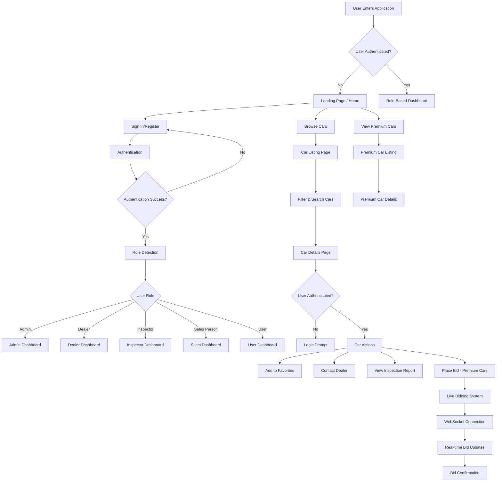
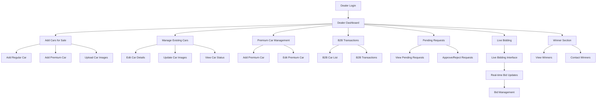
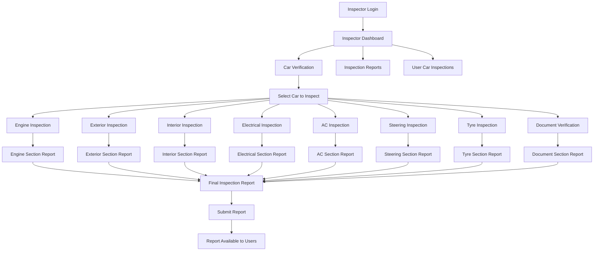
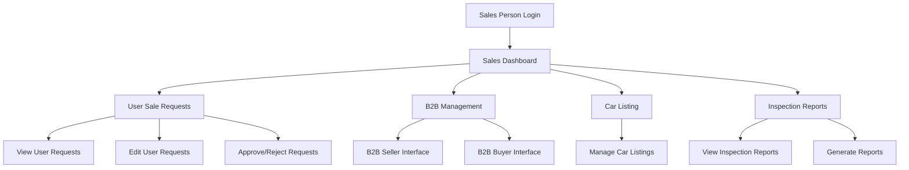
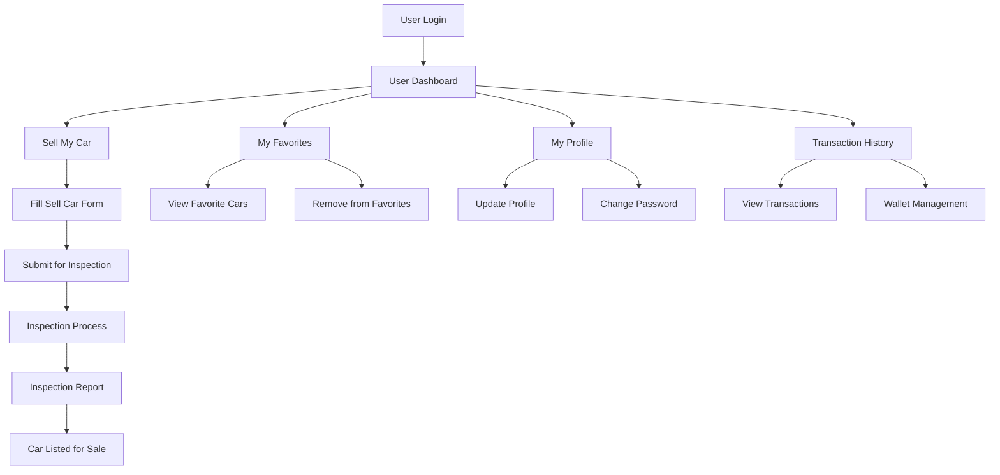
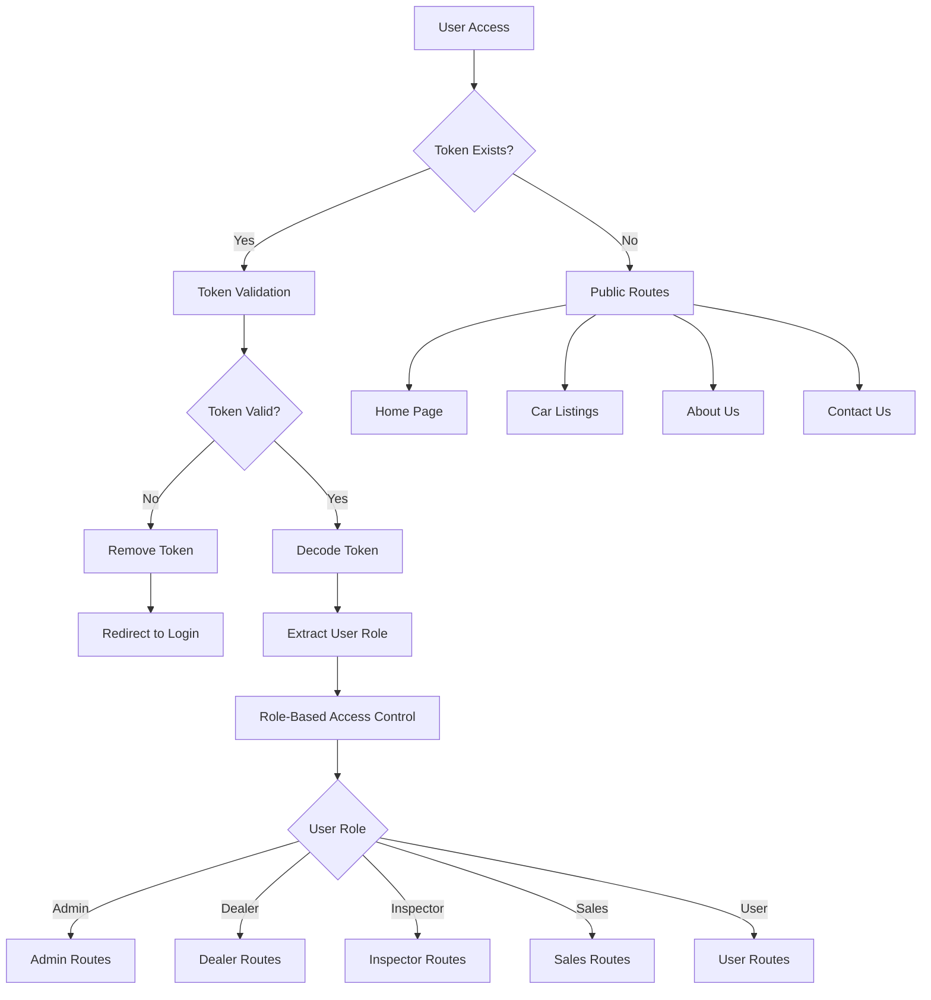
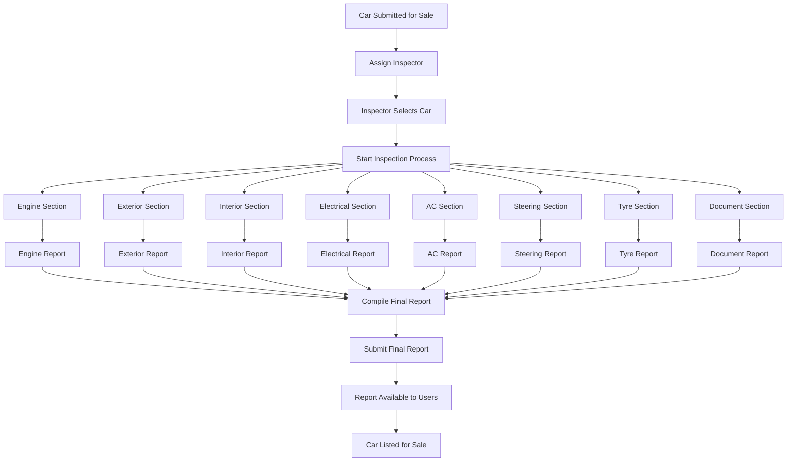

# Car Auction Application - Flow Chart

## Application Overview
This is a comprehensive car auction and bidding platform with multiple user roles (Admin, Dealer, Inspector, Sales Person, User) and real-time WebSocket functionality for live bidding.

## Main Application Flow



## User Role Flows

### 1. Admin Flow

```mermaid
flowchart TD
    A[Admin Login] --> B[Admin Dashboard]
    B --> C[User Management]
    B --> D[Dealer Management]
    B --> E[Inspector Management]
    B --> F[Sales Person Management]
    B --> G[Car Model Management]
    B --> H[Color Management]
    B --> I[Transaction Management]
    B --> J[Bidding Management]
    
    C --> K[View User Requests]
    C --> L[Approve/Reject Users]
    
    D --> M[View Dealer Info]
    D --> N[Edit Dealer Details]
    D --> O[Manage Dealer Cars]
    
    E --> P[View Inspector Info]
    E --> Q[Edit Inspector Details]
    E --> R[Assign Inspections]
    
    F --> S[View Sales Info]
    F --> T[Edit Sales Details]
    
    G --> U[Add Car Models]
    G --> V[Edit Car Models]
    
    H --> W[Add Colors]
    H --> X[Edit Colors]
    
    I --> Y[View Transactions]
    I --> Z[Wallet Management]
    
    J --> AA[View Bidding Cars]
    J --> BB[Manage Bidding Process]
```


### 2. Dealer Flow


### 3. Inspector Flow


### 4. Sales Person Flow


### 5. User Flow


## WebSocket Real-time Bidding Flow

```mermaid
flowchart TD
    A[User Joins Bidding] --> B[WebSocket Connection]
    B --> C[Subscribe to Topics]
    C --> D[/topic/bids]
    C --> E[/topic/topThreeBids]
    C --> F[/topic/liveCars]
    
    D --> G[Receive Bid Updates]
    E --> H[Receive Top Bids]
    F --> I[Receive Live Cars]
    
    G --> J[Update UI in Real-time]
    H --> K[Update Bid Rankings]
    I --> L[Update Car Listings]
    
    M[User Places Bid] --> N[Publish to /app/placeBid]
    N --> O[Server Processes Bid]
    O --> P[Broadcast to /topic/bids]
    P --> Q[All Users Receive Update]
    
    R[Request Top Bids] --> S[Publish to /app/topThreeBids]
    S --> T[Server Returns Top Bids]
    T --> U[Broadcast to /topic/topThreeBids]
    U --> V[Update Bid Rankings]
    
    W[Request Live Cars] --> X[Publish to /app/liveCars]
    X --> Y[Server Returns Live Cars]
    Y --> Z[Broadcast to /topic/liveCars]
    Z --> AA[Update Car Listings]
```

## Authentication & Authorization Flow



## Car Inspection Process Flow



## Key Features Summary

### Real-time Features
- **Live Bidding**: WebSocket-based real-time bidding system
- **Top Bids Tracking**: Real-time updates of top 3 bids per car
- **Live Car Listings**: Real-time updates of available cars

### User Management
- **Multi-role System**: Admin, Dealer, Inspector, Sales Person, User
- **Role-based Access**: Middleware protection for different user types
- **Profile Management**: User profile updates and password changes

### Car Management
- **Car Listings**: Browse and filter cars
- **Premium Cars**: Special premium car category
- **Car Details**: Detailed car information with images
- **Inspection Reports**: Comprehensive car inspection system

### Bidding System
- **Live Bidding**: Real-time auction functionality
- **Bid History**: Track all bids for each car
- **Winner Management**: Handle winning bids and payments

### Transaction System
- **Wallet Management**: User wallet functionality
- **Transaction History**: Track all financial transactions
- **Payment Processing**: Handle payments for won bids

This flow chart represents a comprehensive car auction platform with real-time bidding capabilities, multi-role user management, and extensive car inspection and management features. 